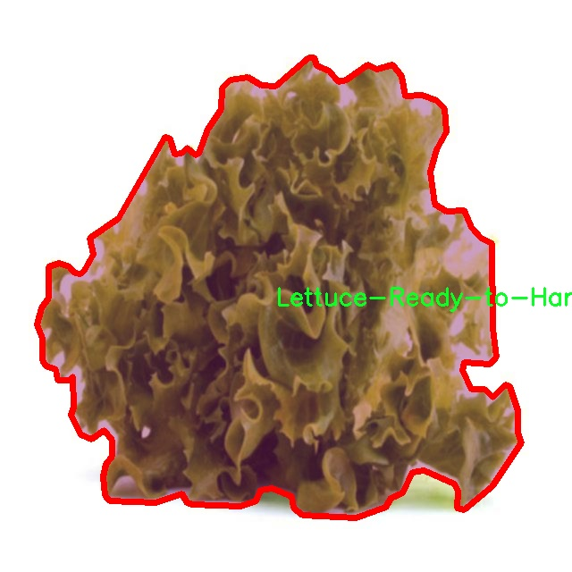

# 生菜成熟度分割系统： yolov8-seg-GhostHGNetV2

### 1.研究背景与意义

[参考博客](https://gitee.com/YOLOv8_YOLOv11_Segmentation_Studio/projects)

[博客来源](https://kdocs.cn/l/cszuIiCKVNis)

研究背景与意义

随着全球人口的持续增长和城市化进程的加快，农业生产面临着前所未有的挑战。传统农业在满足日益增长的食品需求方面显得力不从心，亟需借助现代科技手段进行转型升级。近年来，计算机视觉技术的快速发展为农业领域提供了新的解决方案，尤其是在作物监测和管理方面。生菜作为一种广泛种植的蔬菜，其成熟度的准确判断对于提高产量和减少资源浪费具有重要意义。因此，基于深度学习的图像分割技术在生菜成熟度评估中的应用显得尤为重要。

YOLO（You Only Look Once）系列模型因其高效的实时目标检测能力而受到广泛关注。YOLOv8作为该系列的最新版本，结合了更先进的网络结构和优化算法，能够在保证检测精度的同时提高处理速度。这一特性使得YOLOv8在农业图像分析中的应用潜力巨大，尤其是在生菜成熟度的自动化评估中。通过对生菜的图像进行实例分割，不仅可以识别生菜的种类，还能准确判断其是否达到收获标准，从而为农民提供科学的决策依据。

本研究的目标是基于改进的YOLOv8模型，构建一个高效的生菜成熟度分割系统。我们使用的数据集包含1100张图像，涵盖了“生菜-未成熟”和“生菜-成熟”两个类别。这一数据集的构建为模型的训练和测试提供了丰富的样本，确保了模型在不同生长阶段生菜的准确识别和分割。通过对这些图像的深入分析，我们可以提取出影响生菜成熟度的关键特征，如颜色、形状和纹理等，从而为后续的模型优化提供依据。

在农业生产中，及时判断生菜的成熟度不仅能够提高作物的经济价值，还能有效减少资源的浪费。传统的人工判断方法往往依赖于经验，容易受到主观因素的影响，且效率低下。而基于深度学习的自动化分割系统则能够实现高效、客观的评估，降低人工成本，提高生产效率。此外，该系统的应用还可以与智能农业设备相结合，实现精准农业管理，进一步推动农业的可持续发展。

综上所述，基于改进YOLOv8的生菜成熟度分割系统的研究具有重要的理论价值和实际意义。它不仅为农业生产提供了新的技术手段，还为深度学习在农业领域的应用开辟了新的方向。通过这一研究，我们希望能够为农业智能化发展贡献一份力量，推动现代农业向更高效、更智能的方向迈进。

### 2.图片演示


注意：本项目提供完整的训练源码数据集和训练教程,由于此博客编辑较早,暂不提供权重文件（best.pt）,需要按照6.训练教程进行训练后实现上图效果。

### 3.视频演示

[3.1 视频演示](https://www.bilibili.com/video/BV1tyU2YgEaX/)

### 4.数据集信息

##### 4.1 数据集类别数＆类别名

nc: 2
names: ['Lettuce-Not-Ready-to-Harvest', 'Lettuce-Ready-to-Harvest']


##### 4.2 数据集信息简介

数据集信息展示

在本研究中，我们采用了名为“aquaponic_polygan_test”的数据集，以训练和改进YOLOv8-seg模型，旨在实现生菜成熟度的精准分割。该数据集专门针对水培环境下的生菜生长情况进行设计，包含了丰富的图像数据，能够有效支持我们对生菜成熟度的分类与识别。数据集的类别数量为2，具体包括“Lettuce-Not-Ready-to-Harvest”（未成熟生菜）和“Lettuce-Ready-to-Harvest”（成熟生菜）两大类。这两类的划分不仅为模型的训练提供了明确的目标，也为后续的应用场景奠定了基础。

在数据集的构建过程中，研究团队通过多种方式收集了大量的生菜图像，确保数据的多样性和代表性。图像的拍摄涵盖了不同的生长阶段、光照条件和视角，使得模型在训练过程中能够学习到丰富的特征信息。这种多样性不仅提高了模型的泛化能力，也使得其在实际应用中能够更好地适应不同的环境变化。数据集中每一类生菜的图像都经过精心标注，确保了分割任务的准确性和有效性。

“Lettuce-Not-Ready-to-Harvest”类别的图像主要展示了生菜在不同生长阶段的状态，特征包括叶片的颜色、形状以及生长的密度等。这些特征对于模型判断生菜是否成熟至关重要。通过对这些图像的分析，模型能够学习到未成熟生菜的典型特征，从而在实际应用中实现准确的识别和分割。

而“Lettuce-Ready-to-Harvest”类别则展示了成熟生菜的理想状态，通常表现为鲜艳的绿色和饱满的叶片。这一类别的图像同样多样化，涵盖了不同品种和生长环境下的成熟生菜。通过对这些图像的学习，模型不仅能够识别出成熟生菜的特征，还能够在不同的拍摄条件下保持高准确率。

为了进一步提高模型的性能，我们在数据集的处理上进行了多种增强操作，包括图像旋转、缩放、翻转以及亮度调整等。这些操作不仅增加了数据集的样本数量，也帮助模型在训练过程中更好地适应各种变化，从而提升其鲁棒性。

在训练过程中，我们采用了先进的深度学习技术，通过YOLOv8-seg模型的强大特性，实现了对生菜成熟度的高效分割。数据集的精确标注和丰富的样本使得模型能够在短时间内达到较高的准确率，为生菜的自动化采摘提供了可靠的技术支持。

综上所述，“aquaponic_polygan_test”数据集为生菜成熟度分割系统的开发提供了坚实的基础，其多样性和准确性确保了模型在实际应用中的有效性。通过对该数据集的深入分析与应用，我们期望能够推动农业自动化技术的发展，提高生菜的采摘效率，最终实现更高效的农业生产模式。





### 5.项目依赖环境部署教程（零基础手把手教学）

[5.1 环境部署教程链接（零基础手把手教学）](https://www.bilibili.com/video/BV1jG4Ve4E9t/?vd_source=bc9aec86d164b67a7004b996143742dc)


[5.2 安装Python虚拟环境创建和依赖库安装视频教程链接（零基础手把手教学）](https://www.bilibili.com/video/BV1nA4VeYEze/?vd_source=bc9aec86d164b67a7004b996143742dc)

### 6.手把手YOLOV8-seg训练视频教程（零基础手把手教学）

[6.1 手把手YOLOV8-seg训练视频教程（零基础小白有手就能学会）](https://www.bilibili.com/video/BV1cA4VeYETe/?vd_source=bc9aec86d164b67a7004b996143742dc)


按照上面的训练视频教程链接加载项目提供的数据集，运行train.py即可开始训练



     Epoch   gpu_mem       box       obj       cls    labels  img_size
     1/200     0G   0.01576   0.01955  0.007536        22      1280: 100%|██████████| 849/849 [14:42<00:00,  1.04s/it]
               Class     Images     Labels          P          R     mAP@.5 mAP@.5:.95: 100%|██████████| 213/213 [01:14<00:00,  2.87it/s]
                 all       3395      17314      0.994      0.957      0.0957      0.0843

     Epoch   gpu_mem       box       obj       cls    labels  img_size
     2/200     0G   0.01578   0.01923  0.007006        22      1280: 100%|██████████| 849/849 [14:44<00:00,  1.04s/it]
               Class     Images     Labels          P          R     mAP@.5 mAP@.5:.95: 100%|██████████| 213/213 [01:12<00:00,  2.95it/s]
                 all       3395      17314      0.996      0.956      0.0957      0.0845

     Epoch   gpu_mem       box       obj       cls    labels  img_size
     3/200     0G   0.01561    0.0191  0.006895        27      1280: 100%|██████████| 849/849 [10:56<00:00,  1.29it/s]
               Class     Images     Labels          P          R     mAP@.5 mAP@.5:.95: 100%|███████   | 187/213 [00:52<00:00,  4.04it/s]
                 all       3395      17314      0.996      0.957      0.0957      0.0845


### 7.50+种全套YOLOV8-seg创新点加载调参实验视频教程（一键加载写好的改进模型的配置文件）

[7.1 50+种全套YOLOV8-seg创新点加载调参实验视频教程（一键加载写好的改进模型的配置文件）](https://www.bilibili.com/video/BV1Hw4VePEXv/?vd_source=bc9aec86d164b67a7004b996143742dc)

### YOLOV8-seg算法简介

原始YOLOV8-seg算法原理

YOLOv8-seg是YOLO系列中最新的一个版本，结合了目标检测与图像分割的功能，展现了在实时性和精确性上的卓越表现。该算法的设计理念是将目标检测与分割任务整合为一个统一的框架，旨在提高计算效率的同时，确保高质量的分割结果。YOLOv8-seg在YOLOv8的基础上进行了优化，采用了多种先进的网络结构和技术，以实现更高效的特征提取和处理。

首先，YOLOv8-seg的网络结构可以分为四个主要部分：输入层、主干网络（Backbone）、颈部网络（Neck）和检测头（Head）。输入层负责对输入图像进行预处理，包括调整图像比例、应用Mosaic增强等技术，以增加模型的鲁棒性。主干网络采用了CSPDarknet结构，这一结构通过将特征提取过程分为两个部分，能够有效地提高特征图的表达能力。CSP结构的引入，使得YOLOv8-seg能够在保留轻量级特性的同时，获得更丰富的梯度流动信息。

在特征提取过程中，YOLOv8-seg使用了C2f模块替代了YOLOv5中的C3模块。C2f模块的设计允许输入特征图被分成两个分支，每个分支经过卷积层进行降维处理。这种分支结构不仅提高了特征图的维度，还通过堆叠多个v8_C2fBottleneck层，增强了特征图的深度和复杂性。通过这种方式，YOLOv8-seg能够提取到更加细致和丰富的特征信息，为后续的目标检测和分割任务奠定了坚实的基础。

颈部网络部分，YOLOv8-seg采用了特征金字塔网络（FPN）与路径聚合网络（PAN）的结合，形成了一种双塔结构。这种结构能够有效地促进语义特征与定位特征之间的转移，从而增强了模型对不同尺度目标的检测能力。通过多层次的特征融合，YOLOv8-seg能够在处理复杂场景时，保持高效的特征表达能力，确保检测和分割的准确性。

YOLOv8-seg的检测头部分采用了无锚框（Anchor-Free）检测方式，直接预测目标的中心点和宽高比。这一设计显著减少了对Anchor框的依赖，提高了检测速度和准确度。同时，检测头使用了解耦头结构，将回归分支和分类分支进行分离，进一步加速了模型的收敛过程。这种解耦的设计使得YOLOv8-seg在处理复杂的目标时，能够更灵活地适应不同的场景和目标特征。

在分割任务方面，YOLOv8-seg引入了新的损失函数CloU，旨在提高分割精度。CloU损失函数通过对预测结果与真实标签之间的差异进行优化，增强了模型在边界处理和细节捕捉上的能力。这一改进使得YOLOv8-seg在进行实例分割时，能够更好地处理复杂背景和目标重叠的情况，从而提升了分割的质量。

值得一提的是，YOLOv8-seg在计算效率方面也进行了优化。通过引入快速空间金字塔池化（SPPF）模块，YOLOv8-seg能够在提取不同尺度特征的同时，减少模型的参数量和计算量。这一设计不仅提高了特征提取的效率，还确保了模型在实时应用中的响应速度，适应了各种实际场景的需求。

总的来说，YOLOv8-seg算法通过结合先进的网络结构和技术，成功地将目标检测与图像分割任务整合为一个高效的框架。其独特的特征提取和处理方式，使得YOLOv8-seg在多种应用场景中展现出了卓越的性能，成为计算机视觉领域中的一项重要进展。随着YOLOv8-seg的不断发展和优化，未来在智能监控、自动驾驶、医疗影像等领域的应用前景将更加广阔。


### 9.系统功能展示（检测对象为举例，实际内容以本项目数据集为准）

图9.1.系统支持检测结果表格显示

  图9.2.系统支持置信度和IOU阈值手动调节

  图9.3.系统支持自定义加载权重文件best.pt(需要你通过步骤5中训练获得)

  图9.4.系统支持摄像头实时识别

  图9.5.系统支持图片识别

  图9.6.系统支持视频识别

  图9.7.系统支持识别结果文件自动保存

  图9.8.系统支持Excel导出检测结果数据


### 10.50+种全套YOLOV8-seg创新点原理讲解（非科班也可以轻松写刊发刊，V11版本正在科研待更新）

#### 10.1 由于篇幅限制，每个创新点的具体原理讲解就不一一展开，具体见下列网址中的创新点对应子项目的技术原理博客网址【Blog】：


[10.1 50+种全套YOLOV8-seg创新点原理讲解链接](https://gitee.com/qunmasj/good)

#### 10.2 部分改进模块原理讲解(完整的改进原理见上图和技术博客链接)【如果此小节的图加载失败可以通过CSDN或者Github搜索该博客的标题访问原始博客，原始博客图片显示正常】
### YOLOv8简介
#### Neck模块设计
骨干网络和 Neck 的具体变化为：

第一个卷积层的 kernel 从 6x6 变成了 3x3
所有的 C3 模块换成 C2f，结构如下所示，可以发现多了更多的跳层连接和额外的 Split 操作


去掉了 Neck 模块中的 2 个卷积连接层
Backbone 中 C2f 的 block 数从 3-6-9-3 改成了 3-6-6-3
查看 N/S/M/L/X 等不同大小模型，可以发现 N/S 和 L/X 两组模型只是改了缩放系数，但是 S/M/L 等骨干网络的通道数设置不一样，没有遵循同一套缩放系数。如此设计的原因应该是同一套缩放系数下的通道设置不是最优设计，YOLOv7 网络设计时也没有遵循一套缩放系数作用于所有模型。

#### Head模块设计
Head 部分变化最大，从原先的耦合头变成了解耦头，并且从 YOLOv5 的 Anchor-Based 变成了 Anchor-Free。其结构如下所示：


可以看出，不再有之前的 objectness 分支，只有解耦的分类和回归分支，并且其回归分支使用了 Distribution Focal Loss 中提出的积分形式表示法。

#### Loss 计算
Loss 计算过程包括 2 个部分： 正负样本分配策略和 Loss 计算。 现代目标检测器大部分都会在正负样本分配策略上面做文章，典型的如 YOLOX 的 simOTA、TOOD 的 TaskAlignedAssigner 和 RTMDet 的 DynamicSoftLabelAssigner，这类 Assigner 大都是动态分配策略，而 YOLOv5 采用的依然是静态分配策略。考虑到动态分配策略的优异性，YOLOv8 算法中则直接引用了 TOOD 的 TaskAlignedAssigner。 TaskAlignedAssigner 的匹配策略简单总结为： 根据分类与回归的分数加权的分数选择正样本。

s 是标注类别对应的预测分值，u 是预测框和 gt 框的 iou，两者相乘就可以衡量对齐程度。

对于每一个 GT，对所有的预测框基于 GT 类别对应分类分数，预测框与 GT 的 IoU 的加权得到一个关联分类以及回归的对齐分数 alignment_metrics 。
对于每一个 GT，直接基于 alignment_metrics 对齐分数选取 topK 大的作为正样本
Loss 计算包括 2 个分支： 分类和回归分支，没有了之前的 objectness 分支。
分类分支依然采用 BCE Loss
回归分支需要和 Distribution Focal Loss 中提出的积分形式表示法绑定，因此使用了 Distribution Focal Loss， 同时还使用了 CIoU Loss
Loss 采用一定权重比例加权即可。
#### 训练数据增强
数据增强方面和 YOLOv5 差距不大，只不过引入了 YOLOX 中提出的最后 10 个 epoch 关闭 Mosaic 的操作。假设训练 epoch 是 500，其示意图如下所示：

### RCS-OSA的基本原理
参考该博客，RCSOSA（RCS-One-Shot Aggregation）是RCS-YOLO中提出的一种结构，我们可以将主要原理概括如下：

1. RCS（Reparameterized Convolution based on channel Shuffle）: 结合了通道混洗，通过重参数化卷积来增强网络的特征提取能力。

2. RCS模块: 在训练阶段，利用多分支结构学习丰富的特征表示；在推理阶段，通过结构化重参数化简化为单一分支，减少内存消耗。

3. OSA（One-Shot Aggregation）: 一次性聚合多个特征级联，减少网络计算负担，提高计算效率。

4. 特征级联: RCS-OSA模块通过堆叠RCS，确保特征的复用并加强不同层之间的信息流动。

#### RCS
RCS（基于通道Shuffle的重参数化卷积）是RCS-YOLO的核心组成部分，旨在训练阶段通过多分支结构学习丰富的特征信息，并在推理阶段通过简化为单分支结构来减少内存消耗，实现快速推理。此外，RCS利用通道分割和通道Shuffle操作来降低计算复杂性，同时保持通道间的信息交换，这样在推理阶段相比普通的3×3卷积可以减少一半的计算复杂度。通过结构重参数化，RCS能够在训练阶段从输入特征中学习深层表示，并在推理阶段实现快速推理，同时减少内存消耗。

#### RCS模块
RCS（基于通道Shuffle的重参数化卷积）模块中，结构在训练阶段使用多个分支，包括1x1和3x3的卷积，以及一个直接的连接（Identity），用于学习丰富的特征表示。在推理阶段，结构被重参数化成一个单一的3x3卷积，以减少计算复杂性和内存消耗，同时保持训练阶段学到的特征表达能力。这与RCS的设计理念紧密相连，即在不牺牲性能的情况下提高计算效率。


上图为大家展示了RCS的结构，分为训练阶段（a部分）和推理阶段（b部分）。在训练阶段，输入通过通道分割，一部分输入经过RepVGG块，另一部分保持不变。然后通过1x1卷积和3x3卷积处理RepVGG块的输出，与另一部分输入进行通道Shuffle和连接。在推理阶段，原来的多分支结构被简化为一个单一的3x3 RepConv块。这种设计允许在训练时学习复杂特征，在推理时减少计算复杂度。黑色边框的矩形代表特定的模块操作，渐变色的矩形代表张量的特定特征，矩形的宽度代表张量的通道数。 

#### OSA
OSA（One-Shot Aggregation）是一个关键的模块，旨在提高网络在处理密集连接时的效率。OSA模块通过表示具有多个感受野的多样化特征，并在最后的特征映射中仅聚合一次所有特征，从而克服了DenseNet中密集连接的低效率问题。

OSA模块的使用有两个主要目的：

1. 提高特征表示的多样性：OSA通过聚合具有不同感受野的特征来增加网络对于不同尺度的敏感性，这有助于提升模型对不同大小目标的检测能力。

2. 提高效率：通过在网络的最后一部分只进行一次特征聚合，OSA减少了重复的特征计算和存储需求，从而提高了网络的计算和能源效率。

在RCS-YOLO中，OSA模块被进一步与RCS（基于通道Shuffle的重参数化卷积）相结合，形成RCS-OSA模块。这种结合不仅保持了低成本的内存消耗，而且还实现了语义信息的有效提取，对于构建轻量级和大规模的对象检测器尤为重要。

下面我将为大家展示RCS-OSA（One-Shot Aggregation of RCS）的结构。


在RCS-OSA模块中，输入被分为两部分，一部分直接通过，另一部分通过堆叠的RCS模块进行处理。处理后的特征和直接通过的特征在通道混洗（Channel Shuffle）后合并。这种结构设计用于增强模型的特征提取和利用效率，是RCS-YOLO架构中的一个关键组成部分旨在通过一次性聚合来提高模型处理特征的能力，同时保持计算效率。

#### 特征级联
特征级联（feature cascade）是一种技术，通过在网络的一次性聚合（one-shot aggregate）路径上维持有限数量的特征级联来实现的。在RCS-YOLO中，特别是在RCS-OSA（RCS-Based One-Shot Aggregation）模块中，只保留了三个特征级联。

特征级联的目的是为了减轻网络计算负担并降低内存占用。这种方法可以有效地聚合不同层次的特征，提高模型的语义信息提取能力，同时避免了过度复杂化网络结构所带来的低效率和高资源消耗。

下面为大家提供的图像展示的是RCS-YOLO的整体架构，其中包括RCS-OSA模块。RCS-OSA在模型中用于堆叠RCS模块，以确保特征的复用并加强不同层之间的信息流动。图中显示的多层RCS-OSA模块的排列和组合反映了它们如何一起工作以优化特征传递和提高检测性能。


总结：RCS-YOLO主要由RCS-OSA（蓝色模块）和RepVGG（橙色模块）构成。这里的n代表堆叠RCS模块的数量。n_cls代表检测到的对象中的类别数量。图中的IDetect是从YOLOv7中借鉴过来的，表示使用二维卷积神经网络的检测层。这个架构通过堆叠的RCS模块和RepVGG模块，以及两种类型的检测层，实现了对象检测的任务。 


### 11.项目核心源码讲解（再也不用担心看不懂代码逻辑）

#### 11.1 ultralytics\models\yolo\classify\__init__.py

以下是对给定代码的核心部分进行分析和详细注释的结果：

```python
# 导入Ultralytics YOLO库中的分类模型相关模块
# Ultralytics YOLO 🚀, AGPL-3.0 license

# 从ultralytics.models.yolo.classify.predict模块导入分类预测器
from ultralytics.models.yolo.classify.predict import ClassificationPredictor

# 从ultralytics.models.yolo.classify.train模块导入分类训练器
from ultralytics.models.yolo.classify.train import ClassificationTrainer

# 从ultralytics.models.yolo.classify.val模块导入分类验证器
from ultralytics.models.yolo.classify.val import ClassificationValidator

# 定义模块的公开接口，指定可以被外部访问的类
__all__ = 'ClassificationPredictor', 'ClassificationTrainer', 'ClassificationValidator'
```

### 代码分析

1. **导入模块**：
   - 代码首先导入了三个核心类：`ClassificationPredictor`、`ClassificationTrainer` 和 `ClassificationValidator`。这些类分别用于分类任务的预测、训练和验证。

2. **模块功能**：
   - `ClassificationPredictor`：用于执行分类预测的类，能够对输入数据进行分类。
   - `ClassificationTrainer`：用于训练分类模型的类，负责模型的训练过程，包括数据加载、模型优化等。
   - `ClassificationValidator`：用于验证分类模型性能的类，通常在训练后使用，以评估模型在验证集上的表现。

3. **公开接口**：
   - `__all__` 变量定义了模块的公开接口，只有在使用 `from module import *` 时，才会导入这些指定的类。这有助于控制模块的可见性和使用方式。

### 总结
这段代码的核心在于通过导入和定义公开接口，提供了一个用于YOLO分类任务的基础框架。每个类负责不同的功能，形成了一个完整的分类工作流。

这个文件是Ultralytics YOLO项目中的一个初始化文件，位于`ultralytics/models/yolo/classify/`目录下。它的主要作用是导入与分类相关的模块，并定义了一个公共接口。

首先，文件开头的注释部分表明这是Ultralytics YOLO项目的一部分，并且该项目遵循AGPL-3.0许可证。这意味着该项目是开源的，用户可以自由使用和修改，但在分发时需要遵循相应的许可证条款。

接下来，文件导入了三个重要的类：`ClassificationPredictor`、`ClassificationTrainer`和`ClassificationValidator`。这些类分别负责分类任务中的预测、训练和验证功能。具体来说：

- `ClassificationPredictor`：这个类通常用于进行模型的推理，能够根据输入的数据进行分类预测。
- `ClassificationTrainer`：这个类负责模型的训练过程，通常会包含数据加载、模型训练、损失计算等功能。
- `ClassificationValidator`：这个类用于验证模型的性能，通常会在训练完成后评估模型在验证集上的表现。

最后，`__all__`变量定义了一个公共接口，列出了可以通过`from module import *`语句导入的类。这意味着当其他模块导入这个包时，只能访问这三个类，而不会导入其他未列出的内容。这种做法有助于控制模块的可见性和避免命名冲突。

总的来说，这个文件的主要功能是组织和暴露与YOLO分类相关的功能模块，为其他部分的代码提供清晰的接口。

#### 11.2 ultralytics\data\utils.py

以下是代码中最核心的部分，并附上详细的中文注释：

```python
import os
import hashlib
from pathlib import Path
from PIL import Image, ImageOps
import numpy as np

IMG_FORMATS = 'bmp', 'jpeg', 'jpg', 'png', 'tif', 'tiff'  # 支持的图像格式

def img2label_paths(img_paths):
    """根据图像路径定义标签路径。"""
    sa, sb = f'{os.sep}images{os.sep}', f'{os.sep}labels{os.sep}'  # 图像和标签的子字符串
    return [sb.join(x.rsplit(sa, 1)).rsplit('.', 1)[0] + '.txt' for x in img_paths]

def get_hash(paths):
    """返回路径列表（文件或目录）的单个哈希值。"""
    size = sum(os.path.getsize(p) for p in paths if os.path.exists(p))  # 计算文件大小总和
    h = hashlib.sha256(str(size).encode())  # 基于大小生成哈希
    h.update(''.join(paths).encode())  # 更新哈希以包含路径
    return h.hexdigest()  # 返回哈希值

def exif_size(img: Image.Image):
    """返回经过EXIF校正的PIL图像大小。"""
    s = img.size  # 获取图像的宽度和高度
    if img.format == 'JPEG':  # 仅支持JPEG格式
        exif = img.getexif()  # 获取EXIF信息
        if exif:
            rotation = exif.get(274, None)  # 获取方向标签
            if rotation in [6, 8]:  # 处理旋转情况
                s = s[1], s[0]  # 交换宽高
    return s

def verify_image(args):
    """验证单个图像的有效性。"""
    (im_file, cls), prefix = args
    nf, nc, msg = 0, 0, ''  # 计数器初始化
    try:
        im = Image.open(im_file)  # 打开图像文件
        im.verify()  # 验证图像
        shape = exif_size(im)  # 获取图像大小
        shape = (shape[1], shape[0])  # 转换为(height, width)格式
        assert (shape[0] > 9) & (shape[1] > 9), f'image size {shape} <10 pixels'  # 确保图像尺寸有效
        assert im.format.lower() in IMG_FORMATS, f'invalid image format {im.format}'  # 检查图像格式
        nf = 1  # 图像有效计数
    except Exception as e:
        nc = 1  # 图像无效计数
        msg = f'{prefix}WARNING ⚠️ {im_file}: ignoring corrupt image: {e}'  # 记录错误信息
    return (im_file, cls), nf, nc, msg  # 返回图像信息和计数

def verify_image_label(args):
    """验证图像和标签的配对有效性。"""
    im_file, lb_file, prefix, num_cls = args
    nm, nf, ne, nc, msg = 0, 0, 0, 0, '',  # 初始化计数器
    try:
        # 验证图像
        im = Image.open(im_file)
        im.verify()  # 验证图像
        shape = exif_size(im)  # 获取图像大小
        shape = (shape[1], shape[0])  # 转换为(height, width)格式
        nf = 1  # 图像有效计数

        # 验证标签
        if os.path.isfile(lb_file):
            nf = 1  # 标签存在
            with open(lb_file) as f:
                lb = [x.split() for x in f.read().strip().splitlines() if len(x)]  # 读取标签
                lb = np.array(lb, dtype=np.float32)  # 转换为numpy数组
            nl = len(lb)  # 标签数量
            if nl:
                assert lb.shape[1] == 5, f'labels require 5 columns, {lb.shape[1]} columns detected'  # 检查标签列数
                assert lb.min() >= 0, f'negative label values {lb[lb < 0]}'  # 检查标签值是否为负
            else:
                ne = 1  # 标签为空
        else:
            nm = 1  # 标签缺失
        return im_file, lb, shape, nm, nf, ne, nc, msg  # 返回验证结果
    except Exception as e:
        nc = 1  # 图像无效计数
        msg = f'{prefix}WARNING ⚠️ {im_file}: ignoring corrupt image/label: {e}'  # 记录错误信息
        return [None, None, None, nm, nf, ne, nc, msg]  # 返回错误信息

def check_det_dataset(dataset):
    """
    检查检测数据集的有效性，包括下载和验证数据集。
    """
    # 这里省略具体实现细节，主要是下载、验证和解析数据集的yaml文件
    pass
```

### 代码核心部分解释：
1. **img2label_paths**: 根据图像路径生成对应的标签路径。
2. **get_hash**: 计算给定路径列表的哈希值，用于验证文件完整性。
3. **exif_size**: 获取图像的EXIF信息并返回校正后的图像尺寸。
4. **verify_image**: 验证单个图像的有效性，包括格式和尺寸检查。
5. **verify_image_label**: 验证图像和标签的配对有效性，确保标签存在且格式正确。
6. **check_det_dataset**: 检查数据集的有效性，下载和验证数据集的相关信息。

这些函数构成了数据集处理的基础，确保图像和标签的有效性以及数据集的完整性。

这个程序文件 `ultralytics\data\utils.py` 是用于处理与数据集相关的各种实用功能，特别是在使用 Ultralytics YOLO（一个目标检测模型）时。文件中包含多个函数和类，主要用于图像和标签的验证、数据集的下载和解析、图像处理等。

首先，文件导入了一些必要的库，包括用于文件和路径操作的 `os` 和 `pathlib`，用于图像处理的 `PIL` 和 `cv2`，以及用于数值计算的 `numpy`。此外，还引入了一些 Ultralytics 的工具函数和常量。

文件中定义了几个重要的常量，例如支持的图像和视频格式，以及一个全局变量 `PIN_MEMORY`，用于配置数据加载器的内存管理。

接下来的几个函数主要用于处理图像和标签的路径、哈希值生成、图像大小的校正等。`img2label_paths` 函数根据图像路径生成对应的标签路径，`get_hash` 函数生成文件或目录的哈希值以便于校验，`exif_size` 函数用于获取经过 EXIF 校正的图像尺寸。

`verify_image` 和 `verify_image_label` 函数用于验证单个图像及其对应标签的有效性，包括检查图像格式、尺寸、是否损坏等。这些函数在数据预处理阶段非常重要，可以确保输入数据的质量。

接下来，`polygon2mask` 和 `polygons2masks` 函数用于将多边形转换为二进制掩码，这在图像分割任务中非常有用。它们接受图像尺寸和多边形数据，并返回相应的掩码。

`find_dataset_yaml` 函数用于查找与数据集相关的 YAML 文件，确保数据集的配置文件存在并且格式正确。`check_det_dataset` 和 `check_cls_dataset` 函数则用于检查和下载目标检测和分类数据集，确保数据集的完整性和可用性。

`HUBDatasetStats` 类用于生成与 Ultralytics HUB 相关的数据集统计信息，包括从数据集中提取的统计数据和图像处理。该类支持自动下载数据集并进行必要的验证。

最后，`compress_one_image` 函数用于压缩单个图像以减小文件大小，同时保持其纵横比和质量。`autosplit` 函数则用于自动将数据集拆分为训练、验证和测试集，并生成相应的文本文件。

总体而言，这个文件提供了一系列强大的工具和功能，旨在简化数据集的管理和处理过程，确保在训练目标检测模型时能够使用高质量的数据。

#### 11.3 ultralytics\models\yolo\segment\train.py

以下是经过简化和注释的核心代码部分：

```python
# 导入必要的库和模块
from copy import copy
from ultralytics.models import yolo
from ultralytics.nn.tasks import SegmentationModel
from ultralytics.utils import DEFAULT_CFG, RANK
from ultralytics.utils.plotting import plot_images, plot_results

class SegmentationTrainer(yolo.detect.DetectionTrainer):
    """
    扩展自DetectionTrainer类，用于基于分割模型的训练。
    """

    def __init__(self, cfg=DEFAULT_CFG, overrides=None, _callbacks=None):
        """初始化SegmentationTrainer对象，接受配置和覆盖参数。"""
        if overrides is None:
            overrides = {}
        overrides['task'] = 'segment'  # 设置任务类型为分割
        super().__init__(cfg, overrides, _callbacks)  # 调用父类构造函数

    def get_model(self, cfg=None, weights=None, verbose=True):
        """返回初始化的SegmentationModel模型，使用指定的配置和权重。"""
        # 创建分割模型实例
        model = SegmentationModel(cfg, ch=3, nc=self.data['nc'], verbose=verbose and RANK == -1)
        if weights:
            model.load(weights)  # 如果提供了权重，则加载权重

        return model  # 返回模型实例

    def get_validator(self):
        """返回SegmentationValidator实例，用于YOLO模型的验证。"""
        self.loss_names = 'box_loss', 'seg_loss', 'cls_loss', 'dfl_loss'  # 定义损失名称
        # 创建并返回分割验证器实例
        return yolo.segment.SegmentationValidator(self.test_loader, save_dir=self.save_dir, args=copy(self.args))

    def plot_training_samples(self, batch, ni):
        """绘制训练样本图像，包含标签和边框坐标。"""
        plot_images(batch['img'],  # 图像数据
                    batch['batch_idx'],  # 批次索引
                    batch['cls'].squeeze(-1),  # 类别标签
                    batch['bboxes'],  # 边框坐标
                    batch['masks'],  # 掩码
                    paths=batch['im_file'],  # 图像文件路径
                    fname=self.save_dir / f'train_batch{ni}.jpg',  # 保存文件名
                    on_plot=self.on_plot)  # 绘图回调

    def plot_metrics(self):
        """绘制训练和验证指标。"""
        plot_results(file=self.csv, segment=True, on_plot=self.on_plot)  # 保存结果图像
```

### 代码注释说明：
1. **导入部分**：引入了所需的模块和类，包括YOLO模型、分割模型、默认配置等。
2. **SegmentationTrainer类**：这是一个继承自`DetectionTrainer`的类，专门用于分割任务的训练。
3. **`__init__`方法**：初始化方法，设置任务类型为分割，并调用父类的初始化方法。
4. **`get_model`方法**：用于创建并返回一个分割模型实例，可以选择性地加载预训练权重。
5. **`get_validator`方法**：返回一个验证器实例，用于模型的验证过程，并定义了损失名称。
6. **`plot_training_samples`方法**：绘制训练样本的图像，包括图像、类别、边框和掩码等信息，并保存为文件。
7. **`plot_metrics`方法**：绘制训练和验证的指标，并保存结果图像。

这个程序文件是用于训练YOLO（You Only Look Once）模型进行图像分割的，属于Ultralytics库的一部分。它定义了一个名为`SegmentationTrainer`的类，该类继承自`DetectionTrainer`，并扩展了其功能以支持图像分割任务。

在文件的开头，首先导入了一些必要的模块和类，包括YOLO模型、分割模型、默认配置、排名和绘图工具。接着，`SegmentationTrainer`类的文档字符串提供了一个使用示例，展示了如何实例化和使用该类进行训练。

`__init__`方法是类的构造函数，接受配置参数、覆盖参数和回调函数。它会将任务类型设置为“segment”，并调用父类的构造函数进行初始化。

`get_model`方法用于返回一个初始化的分割模型，接受配置和权重参数。如果提供了权重，它会加载这些权重以初始化模型。

`get_validator`方法返回一个用于验证YOLO模型的实例，设置了损失名称，包括边界框损失、分割损失、分类损失和分布式焦点损失。它使用`SegmentationValidator`类来进行验证。

`plot_training_samples`方法用于绘制训练样本的图像，包括标签和边界框坐标。它接收一个批次的图像数据和批次索引，并生成一张包含训练样本的图像，保存到指定的目录中。

最后，`plot_metrics`方法用于绘制训练和验证过程中的指标，调用`plot_results`函数生成相应的图表，并保存结果。

整体而言，这个文件提供了一个结构化的方式来训练YOLO模型进行图像分割，包含了模型初始化、验证、训练样本可视化和指标绘制等功能。

#### 11.4 ui_style.py

以下是提取出的核心代码部分，并附上详细的中文注释：

```python
import base64  # 导入base64模块，用于进行Base64编码
import streamlit as st  # 导入Streamlit库，用于构建Web应用

# 读取图片并转换为 Base64 编码的函数
def get_base64_of_bin_file(bin_file):
    with open(bin_file, 'rb') as file:  # 以二进制读取模式打开文件
        data = file.read()  # 读取文件内容
    return base64.b64encode(data).decode()  # 将读取的二进制数据进行Base64编码并解码为字符串

# 定义CSS样式的函数
def def_css_hitml():
    st.markdown("""
        <style>
        /* 全局样式 */
        .css-2trqyj, .css-1d391kg, .st-bb, .st-at {
            font-family: 'Gill Sans', 'Gill Sans MT', Calibri, 'Trebuchet MS', sans-serif;  /* 设置字体 */
            background-color: #cadefc;  /* 设置背景颜色 */
            color: #21618C;  /* 设置字体颜色 */
        }

        /* 按钮样式 */
        .stButton > button {
            border: none;  /* 去掉按钮边框 */
            color: white;  /* 设置按钮文字颜色 */
            padding: 10px 20px;  /* 设置按钮内边距 */
            text-align: center;  /* 设置文字居中 */
            text-decoration: none;  /* 去掉文字下划线 */
            display: inline-block;  /* 设置为行内块元素 */
            font-size: 16px;  /* 设置字体大小 */
            margin: 2px 1px;  /* 设置按钮外边距 */
            cursor: pointer;  /* 鼠标悬停时显示为手型 */
            border-radius: 8px;  /* 设置按钮圆角 */
            background-color: #9896f1;  /* 设置按钮背景颜色 */
            box-shadow: 0 2px 4px 0 rgba(0,0,0,0.2);  /* 设置按钮阴影 */
            transition-duration: 0.4s;  /* 设置过渡效果时间 */
        }
        .stButton > button:hover {
            background-color: #5499C7;  /* 鼠标悬停时改变背景颜色 */
            color: white;  /* 鼠标悬停时保持文字颜色 */
            box-shadow: 0 8px 12px 0 rgba(0,0,0,0.24);  /* 鼠标悬停时改变阴影 */
        }

        /* 侧边栏样式 */
        .css-1lcbmhc.e1fqkh3o0 {
            background-color: #154360;  /* 设置侧边栏背景颜色 */
            color: #FDFEFE;  /* 设置侧边栏文字颜色 */
            border-right: 2px solid #DDD;  /* 设置右边框 */
        }

        /* Radio 按钮样式 */
        .stRadio > label {
            display: inline-flex;  /* 设置为行内弹性盒子 */
            align-items: center;  /* 垂直居中对齐 */
            cursor: pointer;  /* 鼠标悬停时显示为手型 */
        }
        .stRadio > label > span:first-child {
            background-color: #FFF;  /* 设置单选按钮背景颜色 */
            border: 1px solid #CCC;  /* 设置边框 */
            width: 1em;  /* 设置宽度 */
            height: 1em;  /* 设置高度 */
            border-radius: 50%;  /* 设置圆形 */
            margin-right: 10px;  /* 设置右边距 */
            display: inline-block;  /* 设置为行内块元素 */
        }

        /* 滑块样式 */
        .stSlider .thumb {
            background-color: #2E86C1;  /* 设置滑块的颜色 */
        }
        .stSlider .track {
            background-color: #DDD;  /* 设置滑轨的颜色 */
        }

        /* 表格样式 */
        table {
            border-collapse: collapse;  /* 合并边框 */
            margin: 25px 0;  /* 设置表格外边距 */
            font-size: 18px;  /* 设置字体大小 */
            font-family: sans-serif;  /* 设置字体 */
            min-width: 400px;  /* 设置表格最小宽度 */
            box-shadow: 0 5px 15px rgba(0, 0, 0, 0.2);  /* 设置表格阴影 */
        }
        thead tr {
            background-color: #a8d8ea;  /* 设置表头背景颜色 */
            color: #ffcef3;  /* 设置表头文字颜色 */
            text-align: left;  /* 设置表头文字左对齐 */
        }
        th, td {
            padding: 15px 18px;  /* 设置单元格内边距 */
        }
        tbody tr {
            border-bottom: 2px solid #ddd;  /* 设置行底部边框 */
        }
        tbody tr:nth-of-type(even) {
            background-color: #D6EAF8;  /* 设置偶数行背景颜色 */
        }
        tbody tr:last-of-type {
            border-bottom: 3px solid #5499C7;  /* 设置最后一行底部边框 */
        }
        tbody tr:hover {
            background-color: #AED6F1;  /* 鼠标悬停时改变行背景颜色 */
        }
        </style>
        """, unsafe_allow_html=True)  # 使用Markdown插入CSS样式，允许使用HTML
```

### 代码说明：
1. **get_base64_of_bin_file**：该函数用于读取指定的二进制文件（如图片），并将其内容转换为Base64编码格式，方便在Web应用中使用。
2. **def_css_hitml**：该函数定义了多个CSS样式，用于美化Streamlit应用的界面，包括全局样式、按钮样式、侧边栏样式、单选按钮样式、滑块样式和表格样式等。通过`st.markdown`方法将这些样式应用到Streamlit应用中。

这个程序文件`ui_style.py`主要用于在Streamlit应用中定义和应用自定义的CSS样式。首先，程序导入了`base64`和`streamlit`库，后者是用于构建Web应用的Python库。

文件中定义了一个函数`get_base64_of_bin_file(bin_file)`，该函数的作用是读取指定的二进制文件（如图片），并将其内容转换为Base64编码。这种编码方式常用于在Web页面中嵌入图像或其他二进制数据，因为它可以将二进制数据转换为文本格式，便于在HTML中使用。

接下来，定义了另一个函数`def_css_hitml()`，该函数通过Streamlit的`st.markdown`方法将一段CSS样式嵌入到应用中。CSS样式主要包括以下几个部分：

1. **全局样式**：设置了应用的字体、背景颜色和文本颜色，确保整个应用具有统一的视觉风格。

2. **按钮样式**：自定义了按钮的外观，包括边框、颜色、内边距、字体大小、边距、圆角、背景色以及悬停时的效果。这些样式使得按钮在用户交互时更加美观和易于识别。

3. **侧边栏样式**：定义了侧边栏的背景色、文本颜色和边框样式，以增强用户界面的层次感。

4. **Radio按钮样式**：自定义了单选按钮的布局和外观，使其更具吸引力并提升用户体验。

5. **滑块样式**：调整了滑块的外观，包括滑块的颜色和轨道的颜色，以使其在视觉上更加协调。

6. **表格样式**：设置了表格的整体样式，包括边框、字体、最小宽度、阴影效果、表头和表格行的背景色、边距等。这些样式使得表格在展示数据时更加清晰易读。

通过这些自定义样式，开发者可以显著提升Streamlit应用的用户界面，使其更具吸引力和可用性。总的来说，这个文件为Streamlit应用提供了一个基础的样式框架，方便后续的界面设计和用户交互。

#### 11.5 ultralytics\models\nas\val.py

以下是经过简化和注释的核心代码部分：

```python
import torch
from ultralytics.utils import ops

class NASValidator:
    """
    Ultralytics YOLO NAS 验证器，用于目标检测。

    该类用于对 YOLO NAS 模型生成的原始预测结果进行后处理。
    它执行非极大值抑制（NMS），以去除重叠和低置信度的框，最终生成最终检测结果。
    """

    def postprocess(self, preds_in):
        """对预测输出应用非极大值抑制（NMS）。"""
        # 将预测框从xyxy格式转换为xywh格式
        boxes = ops.xyxy2xywh(preds_in[0][0])
        
        # 将框和置信度合并，并调整维度顺序
        preds = torch.cat((boxes, preds_in[0][1]), -1).permute(0, 2, 1)
        
        # 应用非极大值抑制，去除重叠的框
        return ops.non_max_suppression(
            preds,                        # 预测结果
            self.args.conf,              # 置信度阈值
            self.args.iou,               # IoU阈值
            labels=self.lb,              # 多标签NMS的标签
            multi_label=False,           # 是否使用多标签
            agnostic=self.args.single_cls,# 是否使用单类
            max_det=self.args.max_det,   # 最大检测框数量
            max_time_img=0.5             # 每张图像的最大处理时间
        )
```

### 代码说明：
1. **导入必要的库**：
   - `torch`：用于张量操作和深度学习模型。
   - `ops`：包含用于处理预测结果的操作函数。

2. **NASValidator类**：
   - 该类用于处理YOLO NAS模型的输出，执行非极大值抑制以获得最终的检测结果。

3. **postprocess方法**：
   - 该方法接收原始预测结果，并对其进行后处理。
   - 首先，将预测框从`xyxy`格式（左上角和右下角坐标）转换为`xywh`格式（中心坐标和宽高）。
   - 然后，将框和对应的置信度合并，并调整张量的维度顺序，以便后续处理。
   - 最后，调用`non_max_suppression`函数，应用NMS以去除重叠的框，并返回最终的检测结果。 

### 注意事项：
- 该类通常不直接实例化，而是在`NAS`类内部使用。

这个程序文件是一个用于对象检测的验证器，名为 `NASValidator`，它是基于 Ultralytics YOLO NAS 模型的。该类继承自 `DetectionValidator`，主要功能是对 YOLO NAS 模型生成的原始预测结果进行后处理。具体来说，它实现了非极大值抑制（Non-Maximum Suppression, NMS）来去除重叠和低置信度的框，从而最终生成最终的检测结果。

在这个类中，有几个重要的属性和方法。首先，`args` 是一个命名空间，包含了多种后处理配置，例如置信度和 IoU（Intersection over Union）阈值。`lb` 是一个可选的张量，用于多标签的 NMS 处理。

在使用示例中，首先导入了 `NAS` 类并创建了一个模型实例。接着，通过模型的 `validator` 属性获取到 `NASValidator` 的实例。假设已经获得了原始预测结果 `raw_preds`，可以调用 `postprocess` 方法对这些预测结果进行处理，得到最终的预测结果。

`postprocess` 方法的核心功能是应用非极大值抑制。它首先将输入的预测结果 `preds_in` 转换为边界框格式（xywh），然后将边界框和相应的置信度合并，最后调用 `ops.non_max_suppression` 方法进行非极大值抑制，去除重叠的框，并根据设定的置信度和 IoU 阈值进行筛选。

需要注意的是，这个类通常不会被直接实例化，而是在 `NAS` 类内部使用。这种设计使得 `NASValidator` 可以专注于处理 YOLO NAS 模型的特定需求，同时利用继承自 `DetectionValidator` 的通用功能。

### 12.系统整体结构（节选）

### 程序整体功能和构架概括

该程序是Ultralytics YOLO项目的一部分，主要用于目标检测和图像分割任务。它的构架包括多个模块和文件，每个文件负责特定的功能。整体上，程序提供了数据处理、模型训练、验证和用户界面样式的功能，旨在简化目标检测和图像分割的工作流程。

- **数据处理**：`ultralytics\data\utils.py`提供了数据集管理和验证的工具，确保输入数据的质量。
- **模型训练**：`ultralytics\models\yolo\segment\train.py`定义了训练YOLO模型进行图像分割的逻辑，包含模型初始化、训练和可视化功能。
- **模型验证**：`ultralytics\models\nas\val.py`实现了对YOLO NAS模型的验证，主要通过非极大值抑制处理预测结果。
- **用户界面**：`ui_style.py`定义了Streamlit应用的CSS样式，提升了用户界面的美观性和可用性。
- **分类模型初始化**：`ultralytics\models\yolo\classify\__init__.py`负责导入与分类相关的模块，提供了分类任务的基本接口。

### 文件功能整理表

| 文件路径                                         | 功能描述                                                                                   |
|------------------------------------------------|-------------------------------------------------------------------------------------------|
| `ultralytics/models/yolo/classify/__init__.py` | 初始化分类模块，导入分类相关的类（如`ClassificationPredictor`、`ClassificationTrainer`、`ClassificationValidator`），提供分类任务的基本接口。 |
| `ultralytics/data/utils.py`                     | 提供数据集管理和验证工具，包括图像和标签的验证、数据集下载、图像处理和统计信息生成等功能。                   |
| `ultralytics/models/yolo/segment/train.py`     | 定义训练YOLO模型进行图像分割的逻辑，包括模型初始化、训练过程、训练样本可视化和指标绘制等功能。                |
| `ui_style.py`                                   | 定义Streamlit应用的CSS样式，设置全局样式、按钮、侧边栏、表格等元素的外观，提升用户界面的美观性和可用性。      |
| `ultralytics/models/nas/val.py`                 | 实现YOLO NAS模型的验证，主要通过非极大值抑制处理预测结果，确保最终检测结果的准确性和有效性。                  |

这个表格清晰地展示了每个文件的功能，使得开发者能够快速理解各个模块的作用和相互关系。

### 13.图片、视频、摄像头图像分割Demo(去除WebUI)代码

在这个博客小节中，我们将讨论如何在不使用WebUI的情况下，实现图像分割模型的使用。本项目代码已经优化整合，方便用户将分割功能嵌入自己的项目中。
核心功能包括图片、视频、摄像头图像的分割，ROI区域的轮廓提取、类别分类、周长计算、面积计算、圆度计算以及颜色提取等。
这些功能提供了良好的二次开发基础。

### 核心代码解读

以下是主要代码片段，我们会为每一块代码进行详细的批注解释：

```python
import random
import cv2
import numpy as np
from PIL import ImageFont, ImageDraw, Image
from hashlib import md5
from model import Web_Detector
from chinese_name_list import Label_list

# 根据名称生成颜色
def generate_color_based_on_name(name):
    ......

# 计算多边形面积
def calculate_polygon_area(points):
    return cv2.contourArea(points.astype(np.float32))

...
# 绘制中文标签
def draw_with_chinese(image, text, position, font_size=20, color=(255, 0, 0)):
    image_pil = Image.fromarray(cv2.cvtColor(image, cv2.COLOR_BGR2RGB))
    draw = ImageDraw.Draw(image_pil)
    font = ImageFont.truetype("simsun.ttc", font_size, encoding="unic")
    draw.text(position, text, font=font, fill=color)
    return cv2.cvtColor(np.array(image_pil), cv2.COLOR_RGB2BGR)

# 动态调整参数
def adjust_parameter(image_size, base_size=1000):
    max_size = max(image_size)
    return max_size / base_size

# 绘制检测结果
def draw_detections(image, info, alpha=0.2):
    name, bbox, conf, cls_id, mask = info['class_name'], info['bbox'], info['score'], info['class_id'], info['mask']
    adjust_param = adjust_parameter(image.shape[:2])
    spacing = int(20 * adjust_param)

    if mask is None:
        x1, y1, x2, y2 = bbox
        aim_frame_area = (x2 - x1) * (y2 - y1)
        cv2.rectangle(image, (x1, y1), (x2, y2), color=(0, 0, 255), thickness=int(3 * adjust_param))
        image = draw_with_chinese(image, name, (x1, y1 - int(30 * adjust_param)), font_size=int(35 * adjust_param))
        y_offset = int(50 * adjust_param)  # 类别名称上方绘制，其下方留出空间
    else:
        mask_points = np.concatenate(mask)
        aim_frame_area = calculate_polygon_area(mask_points)
        mask_color = generate_color_based_on_name(name)
        try:
            overlay = image.copy()
            cv2.fillPoly(overlay, [mask_points.astype(np.int32)], mask_color)
            image = cv2.addWeighted(overlay, 0.3, image, 0.7, 0)
            cv2.drawContours(image, [mask_points.astype(np.int32)], -1, (0, 0, 255), thickness=int(8 * adjust_param))

            # 计算面积、周长、圆度
            area = cv2.contourArea(mask_points.astype(np.int32))
            perimeter = cv2.arcLength(mask_points.astype(np.int32), True)
            ......

            # 计算色彩
            mask = np.zeros(image.shape[:2], dtype=np.uint8)
            cv2.drawContours(mask, [mask_points.astype(np.int32)], -1, 255, -1)
            color_points = cv2.findNonZero(mask)
            ......

            # 绘制类别名称
            x, y = np.min(mask_points, axis=0).astype(int)
            image = draw_with_chinese(image, name, (x, y - int(30 * adjust_param)), font_size=int(35 * adjust_param))
            y_offset = int(50 * adjust_param)

            # 绘制面积、周长、圆度和色彩值
            metrics = [("Area", area), ("Perimeter", perimeter), ("Circularity", circularity), ("Color", color_str)]
            for idx, (metric_name, metric_value) in enumerate(metrics):
                ......

    return image, aim_frame_area

# 处理每帧图像
def process_frame(model, image):
    pre_img = model.preprocess(image)
    pred = model.predict(pre_img)
    det = pred[0] if det is not None and len(det)
    if det:
        det_info = model.postprocess(pred)
        for info in det_info:
            image, _ = draw_detections(image, info)
    return image

if __name__ == "__main__":
    cls_name = Label_list
    model = Web_Detector()
    model.load_model("./weights/yolov8s-seg.pt")

    # 摄像头实时处理
    cap = cv2.VideoCapture(0)
    while cap.isOpened():
        ret, frame = cap.read()
        if not ret:
            break
        ......

    # 图片处理
    image_path = './icon/OIP.jpg'
    image = cv2.imread(image_path)
    if image is not None:
        processed_image = process_frame(model, image)
        ......

    # 视频处理
    video_path = ''  # 输入视频的路径
    cap = cv2.VideoCapture(video_path)
    while cap.isOpened():
        ret, frame = cap.read()
        ......
```


### 14.完整训练+Web前端界面+50+种创新点源码、数据集获取


# [下载链接：https://mbd.pub/o/bread/Z5iZlplx](https://mbd.pub/o/bread/Z5iZlplx)